# Schrödinger's IT Knowledge Base

The following is a knowledge graph to represent the relationships between different sections, tools, processes, and resources of Schrödinger's IT Operations Knowledge Base. Below are visualizations to help understand the organization and content of this knowledge base.

## 1. Hierarchical Structure Chart

This diagram shows the main sections and subsections of the IT Knowledge Base:

```mermaid
graph TD
    KB[IT Knowledge Base] --> HPC[High Performance Computing]
    KB --> IS[Information Security]
    KB --> OPS[Operations]
    KB --> TEMP[Templates]
    
    HPC --> HPCUG[HPC User Guide]
    HPC --> SCHED[Schedulers]
    
    SCHED --> SLURM[Slurm]
    SCHED --> GE[Grid Engine]
    
    HPC --> BOLT[bolt cluster]
    HPC --> PDXGPU[pdxgpu cluster]
    
    OPS --> SS[Systems & Services]
    OPS --> OLS[Office Locations & Services]
    OPS --> HE[Hardware & Equipment]
    OPS --> SA[Software & Applications]
    OPS --> PDS[Policies, Documentation & Support]
    
    SS --> CNI[Cloud & Network Infrastructure]
    SS --> SAB[Storage, Archives & Backups]
    
    CNI --> AWS[AWS]
    CNI --> GCP[GCP]
    CNI --> GHE[GitHub Enterprise]
    
    OLS --> AM[Americas]
    OLS --> EU[Europe]
    OLS --> AP[Asia-Pacific]
    OLS --> PF[Print and Fax]
    OLS --> OEI[Office External IPs]
    
    AM --> PDX[Portland Office]
    AM --> NYC[New York Office]
    AM --> FMA[Framingham Office]
    
    HE --> AD[Apple Devices]
    HE --> HP[Hardware Policies]
    HE --> UW[Ubuntu Workstations]
    HE --> DD[Dell Devices]
    HE --> PER[Peripherals]
    
    AD --> JAMF[JAMF Management]
    AD --> MACOS[MacOS FAQs]
    
    SA --> BROW[Browsers]
    SA --> NRA[Network & Remote Access]
    SA --> DT[Development Tools]
    SA --> SEC[Security & Authentication]
    SA --> SC[Scientific Computing]
    SA --> PA[Productivity Apps]
    SA --> ASL[Approved Software List]
    
    SEC --> OKTA[Okta]
    SEC --> SSH[Passwordless SSH]
    SEC --> JAMFC[JAMF Connect]
    
    PDS --> NEWEMPL[New Employees]
    PDS --> AV[AV Support]
    PDS --> MON[Monitoring]
    PDS --> POL[Policies]
    PDS --> DOCS[Documentation Standards]
    PDS --> TICKETS[JSM Tickets]
```

## 2. Knowledge Base Topic Mindmap

This mindmap shows the key topics and their relationships:

```mermaid
flowchart LR
    KB[IT Knowledge Base]
    
    %% Main sections
    KB --- HPC[High Performance Computing]
    KB --- IS[Information Security]
    KB --- OPS[Operations]
    KB --- TEMP[Templates]
    
    %% HPC section
    HPC --- HPCUG[HPC User Guide]
    HPC --- SCHED[Schedulers]
    HPC --- CLUST[Clusters]
    
    %% HPC User Guide details
    HPCUG --- QT[Quick Tips]
    HPCUG --- CA[Cluster Architecture]
    HPCUG --- GS[Getting Started]
    HPCUG --- JS[Job Server]
    HPCUG --- PP[Project Priorities]
    HPCUG --- Q[Queues]
    HPCUG --- ST[Storage]
    
    %% Schedulers details
    SCHED --- SLURM[Slurm]
    SCHED --- GE[Grid Engine]
    
    %% Clusters details
    CLUST --- BOLT[bolt]
    CLUST --- PDXGPU[pdxgpu]
    
    %% Information Security section
    IS --- AUTH[Authentication]
    IS --- AC[Access Control]
    IS --- SP[Security Policies]
    
    %% Operations section
    OPS --- SS[Systems & Services]
    OPS --- OL[Office Locations]
    OPS --- HE[Hardware & Equipment]
    OPS --- SA[Software & Applications]
    OPS --- PDS[Policies & Support]
    
    %% Systems & Services details
    SS --- CI[Cloud Infrastructure]
    SS --- GHE[GitHub Enterprise]
    SS --- JIRA[Jira]
    SS --- STOR[Storage Solutions]
    
    %% Cloud Infrastructure details
    CI --- AWS[AWS]
    CI --- GCP[GCP]
    
    %% Storage Solutions details
    STOR --- BOX[Box]
    STOR --- NS[Network Storage]
    STOR --- ARCH[Archives]
    STOR --- FTP[FTP]
    
    %% Office Locations details
    OL --- AM[Americas]
    OL --- EU[Europe]
    OL --- AP[Asia-Pacific]
    
    %% Americas details
    AM --- PDX[Portland]
    AM --- NYC[New York]
    AM --- FMA[Framingham]
    
    %% Europe details
    EU --- GER[Germany]
    EU --- READ[Reading]
    EU --- NDC[Newark Datacenter]
    
    %% Asia-Pacific details
    AP --- SEO[Seoul]
    AP --- SH[Shanghai]
    AP --- TKY[Tokyo]
    
    %% Hardware & Equipment details
    HE --- AD[Apple Devices]
    HE --- UW[Ubuntu Workstations]
    HE --- DD[Dell Devices]
    HE --- PER[Peripherals]
    HE --- HP[Hardware Policies]
    
    %% Apple Devices details
    AD --- JAMF[JAMF Management]
    AD --- MACOS[MacOS FAQs]
    AD --- IPAD[iPad Requests]
    
    %% Software & Applications details
    SA --- BROW[Browsers]
    SA --- NRA[Network & Remote Access]
    SA --- DT[Development Tools]
    SA --- SEC[Security & Authentication]
    SA --- SC[Scientific Computing]
    SA --- PA[Productivity Apps]
    SA --- SG[Software Governance]
    
    %% Security & Authentication details
    SEC --- OKTA[Okta]
    SEC --- SSH[Passwordless SSH]
    SEC --- JAMFC[JAMF Connect]
    SEC --- FP[Fingerprint Authentication]
    
    %% Policies & Support details
    PDS --- NEO[New Employee Onboarding]
    PDS --- AVS[AV Support]
    PDS --- MON[Monitoring]
    PDS --- DS[Documentation Standards]
    PDS --- TS[Ticket Submission]
    
    %% Templates details
    TEMP --- HTG[How-to Guides]
    TEMP --- TA[Troubleshooting Articles]
    
    %% Style
    classDef section fill:#f9f,stroke:#333,stroke-width:2px;
    classDef subsection fill:#bbf,stroke:#333,stroke-width:1px;
    classDef item fill:#ddd,stroke:#333,stroke-width:1px;
    
    class KB,HPC,IS,OPS,TEMP section;
    class HPCUG,SCHED,CLUST,AUTH,AC,SP,SS,OL,HE,SA,PDS subsection;
    class QT,CA,GS,JS,PP,Q,ST,SLURM,GE,BOLT,PDXGPU,CI,GHE,JIRA,STOR,AM,EU,AP,AD,UW,DD,PER,HP,BROW,NRA,DT,SEC,SC,PA,SG,NEO,AVS,MON,DS,TS,HTG,TA item;
```

## 3. Key Relationship Types in the Knowledge Graph

While the mindmap above shows the hierarchical structure, it doesn't explicitly show the relationship types between entities. Here are some of the important relationships identified in the knowledge graph:

### High Performance Computing Relationships

- **High Performance Computing contains HPC User Guide**: The HPC section includes a comprehensive user guide for working with the clusters
- **High Performance Computing contains Schedulers**: The HPC section includes documentation on job schedulers
- **High Performance Computing manages bolt and pdxgpu clusters**: The HPC section is responsible for these computing clusters
- **Slurm schedules bolt and pdxgpu**: The Slurm scheduler is used to manage jobs on both clusters
- **Grid Engine schedules bolt**: The Grid Engine scheduler is used as an alternative on the bolt cluster
- **Passwordless SSH enablesAccessTo High Performance Computing**: SSH authentication is used to access the HPC resources

### Security Relationships

- **Security & Authentication documents Okta, Passwordless SSH, and JAMF Connect**: The security section provides documentation for these authentication methods
- **Okta supports Fingerprint Authentication**: The Okta identity provider supports fingerprint-based authentication
- **JAMF Connect integratesWith Okta**: JAMF Connect integrates with Okta for authentication

### Hardware & Software Relationships

- **JAMF manages Apple Devices**: Apple devices are managed through the JAMF device management tool
- **JAMF provides Self Service**: The JAMF tool provides the Self Service application for software installation
- **Apple Devices follows MacOS Upgrade Process**: Apple devices follow a specific process for OS upgrades
- **Apple Devices uses Network Drive Mounting**: Documentation explains how to mount network drives on Apple devices

## 4. IT Knowledge Base Navigation Flowchart

This "20 questions" style flowchart helps users find the information they need:

```mermaid
graph TD
    START[What are you looking for?] --> HPC{High Performance Computing?}
    START --> SEC{Security related?}
    START --> OFFICE{Office location info?}
    START --> HARDWARE{Hardware/equipment?}
    START --> SOFTWARE{Software/applications?}
    START --> POLICY{Policies/documentation?}
    
    HPC --> |Yes| HPC_Q{What specifically?}
    HPC_Q --> |User Guide| HPCUG[HPC User Guide]
    HPC_Q --> |Job Scheduling| SCHED[Schedulers - Slurm/Grid Engine]
    HPC_Q --> |Cluster Info| CLUSTER[Cluster Architecture]
    HPC_Q --> |Storage| HPCSTOR[HPC Storage and Quotas]
    
    SEC --> |Yes| SEC_Q{What specifically?}
    SEC_Q --> |Authentication| AUTH[Okta/JAMF Connect]
    SEC_Q --> |SSH Setup| SSH[Passwordless SSH]
    SEC_Q --> |General Security| GENSEC[Information Security]
    
    OFFICE --> |Yes| OFFICE_Q{Which region?}
    OFFICE_Q --> |Americas| AM_Q{Which office?}
    OFFICE_Q --> |Europe| EU_Q{Which office?}
    OFFICE_Q --> |Asia-Pacific| AP_Q{Which office?}
    
    AM_Q --> |Portland| PDX[Portland Office]
    AM_Q --> |New York| NYC[New York Office]
    AM_Q --> |Framingham| FMA[Framingham Office]
    
    EU_Q --> |Germany| MHG[Germany Office]
    EU_Q --> |UK| LON[Reading Office]
    EU_Q --> |Datacenter| EWR[Newark Datacenter]
    
    AP_Q --> |Korea| KOR[Seoul Office]
    AP_Q --> |China| CHN[Shanghai Office]
    AP_Q --> |Japan| TYO[Tokyo Office]
    
    HARDWARE --> |Yes| HW_Q{What type?}
    HW_Q --> |Apple| APPLE[Apple Devices]
    HW_Q --> |Dell| DELL[Dell Devices]
    HW_Q --> |Ubuntu| UBUNTU[Ubuntu Workstations]
    HW_Q --> |Peripherals| PERIPH[Peripherals]
    HW_Q --> |Policies| HWPOL[Hardware Policies]
    
    APPLE --> APPLE_Q{What specifically?}
    APPLE_Q --> |JAMF| JAMF[JAMF Management]
    APPLE_Q --> |MacOS Help| MACOS[MacOS FAQs]
    APPLE_Q --> |iPad| IPAD[iPad Request Process]
    
    SOFTWARE --> |Yes| SW_Q{What type?}
    SW_Q --> |Browsers| BROWSER[Browsers]
    SW_Q --> |Network| NETWORK[Network & Remote Access]
    SW_Q --> |Development| DEV[Development Tools]
    SW_Q --> |Security| SWSEC[Security & Authentication]
    SW_Q --> |Scientific| SCI[Scientific Computing]
    SW_Q --> |Productivity| PROD[Productivity Apps]
    SW_Q --> |Approved List| SWLIST[Approved Software List]
    
    POLICY --> |Yes| POL_Q{What specifically?}
    POL_Q --> |New Employee| NEWEMP[New Employee Guide]
    POL_Q --> |AV Support| AVSUP[AV Support]
    POL_Q --> |Documentation| DOCSTD[Documentation Standards]
    POL_Q --> |Tickets| TICKET[Submitting Tickets]
```

## Key Insights from Analysis

1. **Comprehensive IT Infrastructure Documentation**: The knowledge base provides extensive documentation covering all aspects of Schrödinger's IT infrastructure, from high-performance computing clusters to office-specific resources.

2. **Focus on Scientific Computing**: The presence of detailed HPC documentation suggests Schrödinger's emphasis on scientific computing and research capabilities.

3. **Global Organization**: The office locations section reveals Schrödinger's global presence across Americas, Europe, and Asia-Pacific regions.

4. **Standardized Documentation**: The Templates section indicates an effort to maintain consistent documentation formats across the knowledge base.

5. **Security Integration**: Multiple authentication systems (Okta, JAMF Connect) are integrated to provide secure access to resources.

6. **Apple-Centric Environment**: Significant documentation around Apple devices, JAMF management, and MacOS suggests a primarily Apple-based computing environment.

7. **Structured Knowledge Organization**: The knowledge base is well-organized into logical sections and subsections, making it easier for users to find relevant information.

This analysis provides a comprehensive overview of Schrödinger's IT infrastructure, policies, and resources as documented in their Confluence knowledge base.
